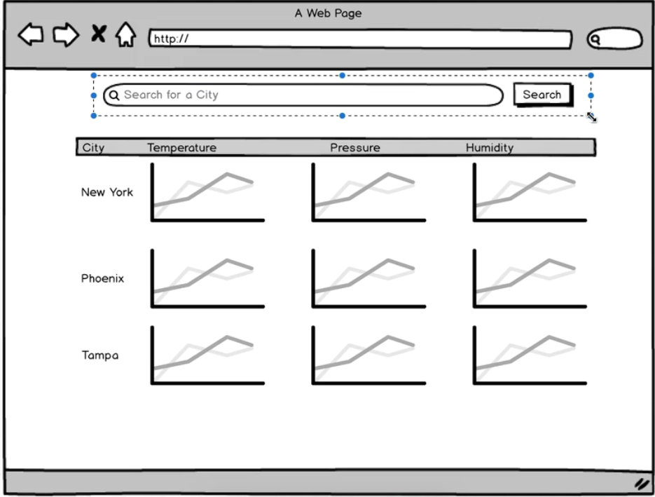

参考：https://github.com/StephenGrider/ReduxCasts

 

> 要做成的效果

 

 

- SearchBar
- App: Chart, ForecastList

 

> https://github.com/StephenGrider/ReduxSimpleStarter

 

> 把下载下来的所有文件保存到本地目录中

 

> npm install

 

> npm start

 

> http://localhost:8080/

 

