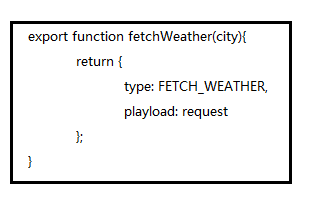
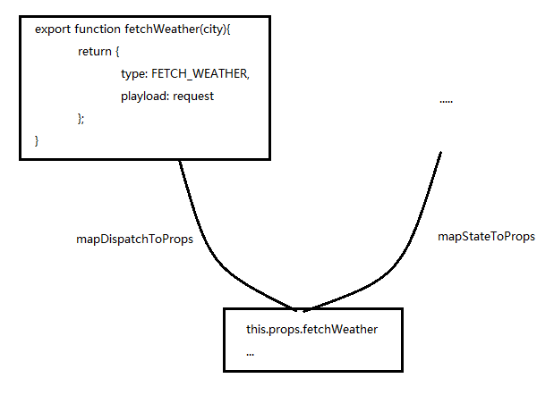
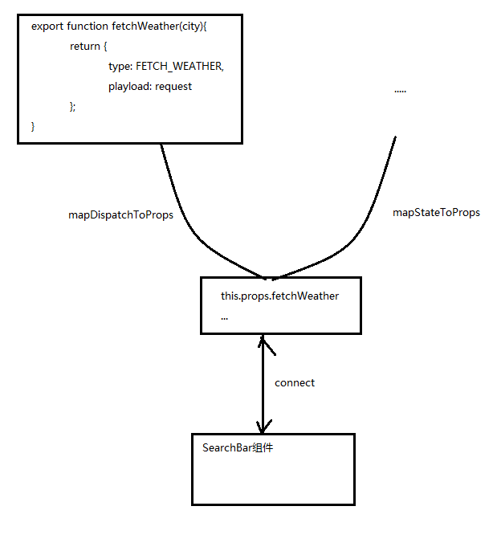

> npm install axios --save

 

> src/actions/index.js

 

	import axios from 'axios';
	
	const API_KEY = '0605f5e00484c325d472779b53a79c02';
	
	export const FETCH_WEATHER = 'FETCH_WEATHER';
	const ROOT_URL = `http://api.openweathermap.org/data/2.5/forecast?appid=${API_KEY}`;
	
	export function fetchWeather(city){
	    const url = `${ROOT_URL}&q=${city},us`;
	    const request = axios.get(url);
	    
	    return {
	      type: FETCH_WEATHER,
	      payload: request
	    };
	}

 

> src/containers/search_bar.js

 

首先让上面的方法和props.fetchWeather之间建立映射：

	function mapDispatchToProps(dispatch){
	    return bindActionCreators({fetchWeather}, dispatch);
	}
以上，使用bindActionCreators建立映射。正常情况下，这里应该还有mapStatetoProps方法，但这里没有。

 

然后使用connect方法把组件和映射连接起来。

	export default connect(null, mapDispatchToProps)(SearchBar);

 

组件就有了fetchWeather方法，当调用这个方法，redux会调用它的dispatch方法。

 

完整如下：

	import React, { Component } from 'react';
	import { connect } from 'react-redux';
	import { bindActionCreators } from 'redux';
	import { fetchWeather } from '../actions/index';
	
	
	class SearchBar extends Component{
	    
	    constructor(props){
	        super(props);
	        this.state = {term: ''};
	        this.onInputChange = this.onInputChange.bind(this);
	        this.onFormSubmit = this.onFormSubmit.bind(this);
	    }
	    
	    onInputChange(event){
	        this.setState({term: event.target.value});
	    }
	    
	    onFormSubmit(event){
	        event.preventDefault();
	        this.props.fetchWeather(this.state.term);
	        this.setState({term: ''});
	    }
	    
	    render(){
	        return (
	            <form
	                className="input-group"
	                onSubmit={this.onFormSubmit}>
	                <input 
	                    placeholder="get a five-day forecast in your favorite cities"
	                    className="form-control"
	                    value={this.state.term}
	                    onChange={this.onInputChange}
	                />
	                
	                    <button type="submit" className="btn btn-secondary">Submit</button>
	                
	            </form>
	        );
	    }
	}
	
	
	function mapDispatchToProps(dispatch){
	    return bindActionCreators({fetchWeather}, dispatch);
	}
	
	export default connect(null, mapDispatchToProps)(SearchBar);

 

> localhost:8080

 
在控制台已经能获取到数据。

 
**以上，能证明API是通的。**

 

接下来，我们想知道，从API获取到的数据，**在action和reducer中分别是什么状况？**

 

> src/actions/index.js

 

在其中打印出从API获取到的数据：

	
	import axios from 'axios';
	
	const API_KEY = '0605f5e00484c325d472779b53a79c02';
	
	export const FETCH_WEATHER = 'FETCH_WEATHER';
	const ROOT_URL = `http://api.openweathermap.org/data/2.5/forecast?appid=${API_KEY}`;
	
	export function fetchWeather(city){
	    const url = `${ROOT_URL}&q=${city},us`;
	    const request = axios.get(url);
	    
	    console.log('Request:', request);
	    
	    return {
	      type: FETCH_WEATHER,
	      payload: request
	    };
	}

 

> 在src/reducers目录下，添加reducer_weather.js

 

	export default function(state=null, action){
	    console.log('Action received', action);
	    return state;
	}
也就是，在reducer中打印出action。

 

> 把刚创建的reducer注册到src/reducers/index.js中去

 

	import { combineReducers } from 'redux';
	import WeatherReducer from './reducer_weather';
	
	const rootReducer = combineReducers({
	  weather: WeatherReducer
	});
	
	export default rootReducer;

 

> localhost:8080

 

可以看到，当页面第一次加载，未输入搜索条件的时候，控制台打印出的是promise.

 

> 输入：New York

 

从reducer中打印出的语句类似这样：{type: "FETCH_WEATHER", payload: Object}，获取到的是实实在在的数据。

 

**由此，我们也可以看出：action用来返回数据， reducer根据不同的type来更新状态。**

 

**换句话说，一个reducer处理多个action, reducer和action之间是1对多关系。**

 

> src/reducers/reducer_weather.js, 完善如下

 

	import { FETCH_WEATHER } from '../actions/index';
	
	export default function(state=[], action){
	    //console.log('Action received', action);
	    switch(action.type){
	       // 或者写成
	       // [action.payload.data, ...state]
	       return state.concat([action.payload.data]);
	    }
	    return state;
	}

 

